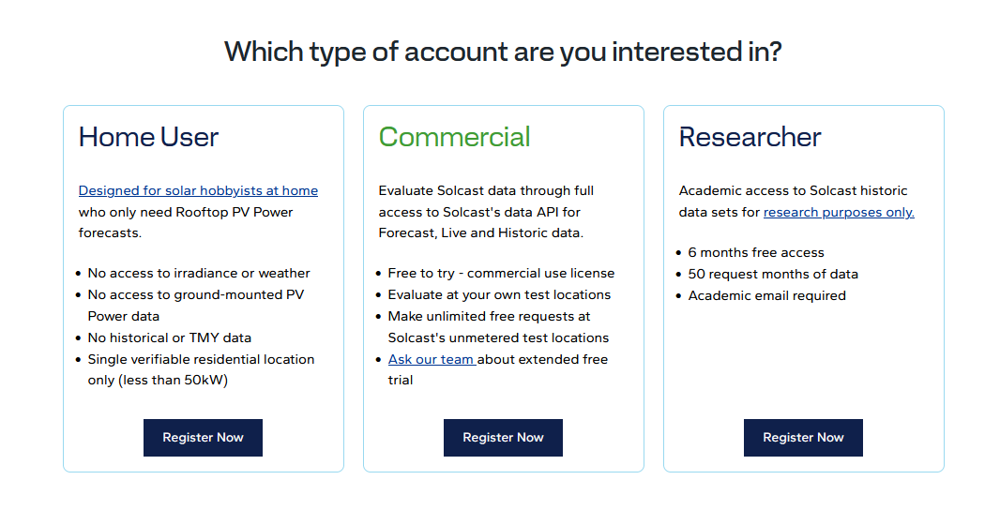
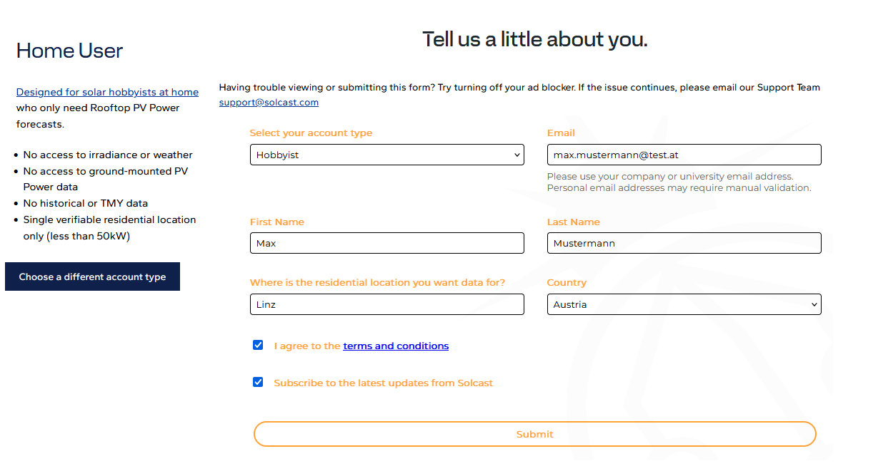
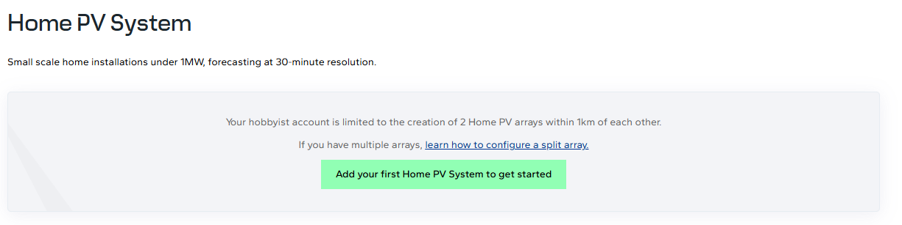
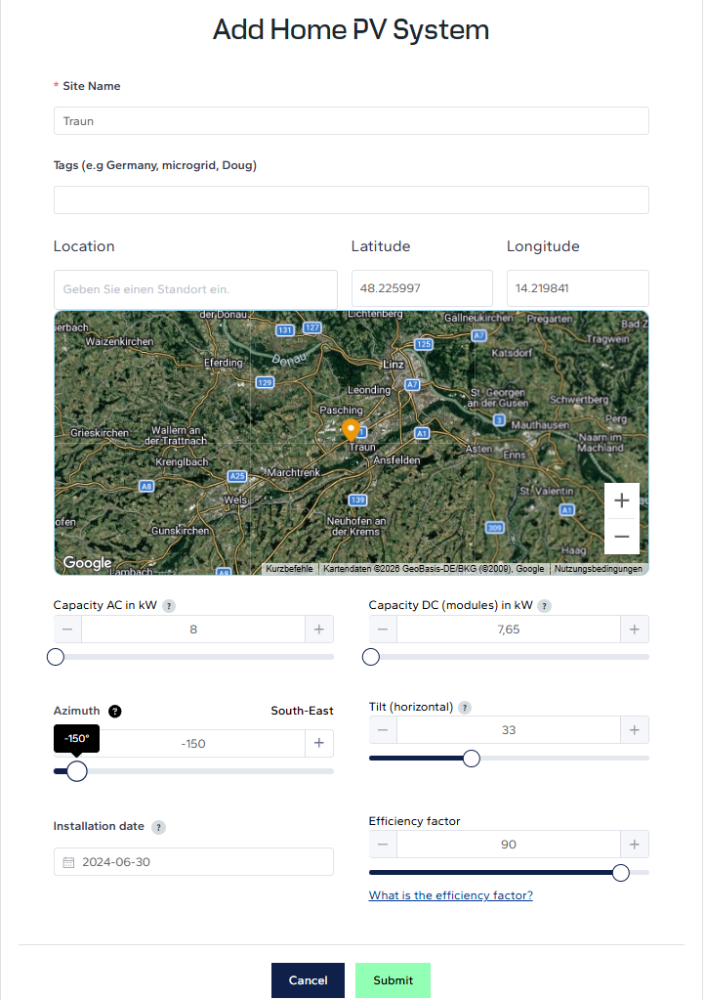
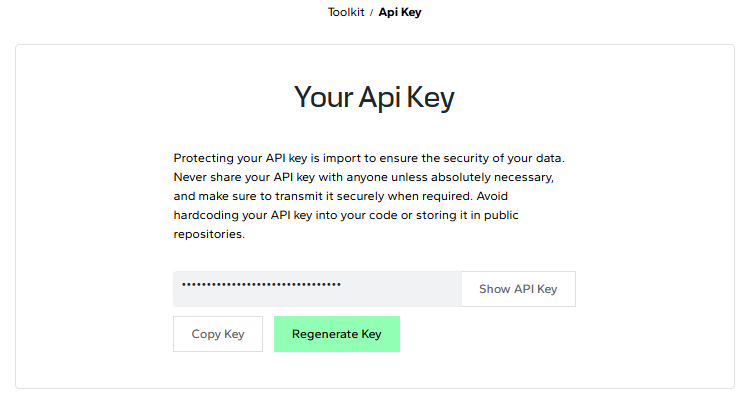
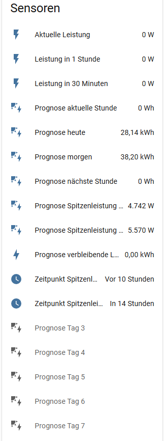

# Solcast Solar einrichten

## 1. Registrierung bei Solcast

1. Gehe auf [toolkit.solcast.com.au](https://toolkit.solcast.com.au/) um dich zu registrieren.
2. Wähle dort den Accounttyp **Home User**. 
   
3. Wähle **Hobbyist**, gib deine Daten ein und klicke auf **Submit**. 
   
4. Wähle ein Passwort und klicke auf **Submit**.
5. Du erhältst eine E-Mail zur Bestätigung — öffne den Link darin.
6. Melde dich mit dem neuen Benutzer an.
7. Klicke auf **„Add your first Home PV System to get started"**. 
   
8. Daten der PV-Anlage erfassen:
    - **Capacity (kW)** — Anlagenleistung in kWp (z.B. 10)
    - **Tilt** — Dachneigung in Grad (typisch 30–35°)
    - **Azimuth** — Ausrichtung: 0°=Nord, -90°=Ost, ±180°=Süd, 90°=West

    Auf **Submit** klicken. 
    

9. **Mehrere Ausrichtungen (Ost/West)?** Klicke auf **„Add another PV System"** und erfasse die zweite Dachfläche separat. Beide nutzen denselben API-Key.
10. Öffne oben rechts das Menü neben dem Benutzernamen und klicke auf **Your API Key**.
11. Kopiere den angezeigten Key für später. 
    

## 2. Installation der Integration

> [!NOTE]
> **Vorbereitetes EEG-Gerät (Home Assistant Green) erhalten?** Dann ist die Solcast-Integration bereits installiert — überspringe diesen Abschnitt und mache direkt bei Punkt 3 weiter.

_**Voraussetzung:** [HACS](https://hacs.xyz/) muss installiert sein (Solcast ist eine Custom Integration, kein HA-Standard)._

1. Gehe zu **HACS → Integrationen → Suche „Solcast PV Forecast"**
2. Installiere die Integration und starte Home Assistant neu.

## 3. Solcast-Konto verbinden

_Dieser Abschnitt gilt für **alle** — auch bei einem vorbereiteten EEG-Gerät, denn jedes Mitglied nutzt seinen eigenen API-Key._

1. Gehe zu **Einstellungen → Geräte & Dienste → Integration hinzufügen** und wähle **Solcast Solar**.
2. Gib den zuvor kopierten API-Key ein, lasse die restlichen Einstellungen wie vorausgewählt und klicke auf **OK**.
3. Aktiviere die deaktivierten Prognose-Sensoren für die Tage 3 bis 7: Klicke den Sensor an, dann auf das Zahnrad und stelle ihn auf **Aktiviert**. 
   

## 4. Prüfen

1. Warte 1–2 Minuten nach der Einrichtung
2. Prüfe unter **Entwicklerwerkzeuge → Zustände**: Suche nach `solcast`
3. Die Sensoren `sensor.solcast_pv_forecast_prognose_fuer_heute` und `sensor.solcast_pv_forecast_prognose_fuer_morgen` sollten kWh-Werte zeigen
4. Kehre hierher zurück — die Sensoren werden automatisch zugeordnet
