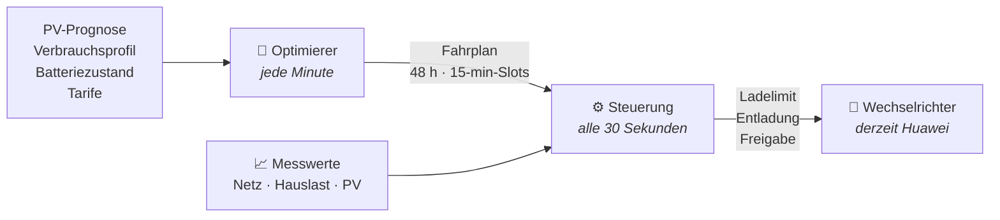
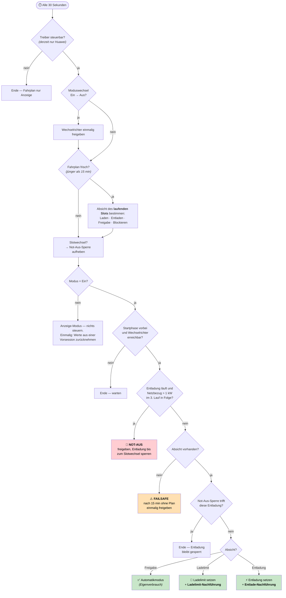

# Die Steuerung — vom Fahrplan zum Wechselrichter

Der EEG Energy Optimizer trennt **Rechnen** und **Steuern** strikt:

* Der **Optimierer** rechnet **jede Minute** den erlösbesten Lade- und
  Entladeplan über 48 Stunden — allein aus den Preisen je Viertelstunde, ohne
  Zeitfenster und ohne benannte Zustände. Er schreibt **nie** an den
  Wechselrichter. Gibt der Preisverlauf nichts her, plant er auch nichts.
* Die **Steuerung** läuft **alle 30 Sekunden**, hält den zuletzt gerechneten
  Fahrplan gegen die Messwerte und ist die **einzige** Stelle, die den
  Wechselrichter anfasst.



Warum zwei Takte? Der Plan ändert sich langsam (die Welt der Prognosen), die
Realität schnell (eine Wolke, ein Wasserkocher). Die Steuerung gleicht beides
aus: Sie setzt die **Absicht** des laufenden Slots um, korrigiert sie aber mit
den **gemessenen** Werten.

---

## Ein Steuerungslauf (alle 30 Sekunden)

Jeder Lauf ist eine Prüfkette mit genau **einer** Aktion am Ende. Die Absicht
wird auch im Modus **Aus** bestimmt (fürs Dashboard) — geschrieben wird nur im
Modus **Ein**.



### Vom Slot zur Absicht

Der laufende Fahrplan-Slot wird treiberneutral in genau eine Absicht übersetzt:

| Slot plant … | Absicht | Warum |
|---|---|---|
| **Laden** (`battery_p < 0`) | Ladelimit = Planleistung | Die Batterie darf höchstens so schnell laden, wie der Plan vorsieht — der Rest der PV geht ins Netz. |
| **Einspeisen aus der Batterie** (`battery_p > 0`, `grid_p > 0`) | Erzwungene Entladung | Energie soll aktiv in die Energiegemeinschaft. |
| **Entladen nur für den Hausverbrauch** | Freigabe | Das erledigt der Wechselrichter im Automatikmodus selbst — kein Eingriff nötig. |
| **Nichts** (`battery_p ≈ 0`), Batterie hat Platz | Ladelimit = 0 | Freigeben wäre falsch: Der Automatikmodus würde PV-Überschuss in die Batterie laden, den der Plan einspeisen will. An einem Sonnenmorgen sieht das dann von außen wie eine „Morgen-Einspeisung" aus — es ist aber keine Regel, sondern nur das Ergebnis der Preise dieses Tages. |
| **Nichts** (`battery_p ≈ 0`), Batterie voll (≥ 99 %) | Freigabe | „Nicht laden" ist hier keine Absicht, sondern Platzmangel. Ein Ladelimit 0 bewirkt nichts und stünde nur im Weg, sobald wieder Platz entsteht. Kein Eingriff, der Standardwert bleibt. |

---

## Die zwei Nachführungen

Prognosen sind nie exakt. Zwei Korrekturen halten den Plan gegen die Realität —
beide arbeiten mit **Messwerten**, nicht mit Prognosen.

### Ladelimit-Nachführung

Das Ladelimit wird **immer** geschrieben, sobald der Slot Laden (oder
Blockieren) plant — mit oder ohne Einspeisegrenze. Die Nachführung ist die
**Korrektur obendrauf** und läuft nur, wenn eine Einspeisegrenze konfiguriert
ist: Klebt die gemessene Einspeisung an der Grenze, regelt der Wechselrichter
gerade still ab — dann darf die Batterie mehr aufnehmen als geplant, damit
nichts verloren geht.

```
Gemessene Einspeisung                        Reaktion pro Lauf (30 s)
─────────────────────────────────────────────────────────────────────
━━━ Grenze ━━━━━━━━━━━━━━━━━━━━━━━━━┓
                                    ┣━ „klebt" (± 0,1 kW):
   Grenze − 0,1 kW ─────────────────┛      Ladelimit + 0,5 kW  ▲
                                    ┓
                                    ┣━ totes Band: nichts tun  ▬
   Grenze − 0,3 kW ─────────────────┛
                                    ┓
                                    ┣━ deutlich darunter:
   darunter                         ┛      − 0,5 kW zurück Richtung
                                           Fahrplanwert, nie darunter  ▼
```

Das **asymmetrische tote Band** verhindert Pendeln zwischen Anheben und
Rücknahme. Ohne Einspeisegrenze (oder wenn der Netz-Messwert fehlt) wird
schlicht der Fahrplanwert geschrieben — fail-open.

### Entlade-Nachführung

Der Wechselrichter deckt bei einer erzwungenen Entladung **zuerst den
Hausverbrauch**, nur der Rest wird eingespeist. Damit die *geplante*
Einspeisung tatsächlich am Netzanschluss ankommt, wird die gemessene Hauslast
aufgeschlagen:

```
Entladeleistung = Plan-Einspeisung + gemessene Hauslast − aktuelle PV
                  (gedeckelt auf die maximale Entladeleistung der Batterie)

Ziel-SOC        = geplanter Ladestand am ENDE des laufenden Slots
```

Liefert die PV gerade genug, um den Plan zu decken (Rest < 0,05 kW), wird gar
nicht erzwungen entladen — Freigabe. Ist die Hauslast nicht messbar, greift die
Prognose des Slots (fail-open, geloggt).

---

## Sicherheitsnetze

| Netz | Auslöser | Wirkung |
|---|---|---|
| 🛑 **Not-Aus** | Netzbezug > 1 kW in 3 aufeinanderfolgenden Läufen (= 90 s) während einer Entladung | Entladung stoppen, bis zum nächsten Slotwechsel sperren. Verhindert, dass Strom teuer gekauft und billig verkauft wird. |
| ⚠️ **Failsafe** | Kein brauchbarer Fahrplan seit 15 Minuten (Optimierer eingefroren, Daten fehlen) | Wechselrichter einmalig in den Automatikmodus freigeben — kein Limit bleibt stehen. |
| 🔄 **Freigabe bei Ein → Aus** | Moduswechsel | Sofortige Freigabe, sonst bliebe das letzte Ladelimit im Gerät stehen. Gleiches beim Entladen der Integration (Neustart, Konfig-Änderung). |
| ⏳ **Startphase** | Erste 90 Sekunden nach dem Start | Noch keine Steuerbefehle — erst Messwerte sammeln. |
| ♻️ **Nachgeholte Freigabe** | Erster Lauf nach einem Neustart, während wir *nicht* steuern | Ein Limit aus der Vorsession käme im Anzeige-Modus sonst nie zurück — es würde dort nie geschrieben. Wird bis zum Erfolg wiederholt. |
| 📏 **Totbänder** | Änderung ≤ 0,2 kW (Ladelimit, Entladeleistung) bzw. < 1 %-Punkt (Ziel-SOC) | Nicht schreiben — der Wert im Gerät ist noch gut genug. Minimiert die Schreibzugriffe drastisch. |

---

## Freigabe heißt: Standardwert

„Freigabe" ist kein eigener Zustand im Wechselrichter, sondern die Rückkehr zu
seinen Standardwerten: Das Ladelimit wird auf das Maximum der Number-Entität
gesetzt (bei einer 5-kW-Batterie also 5 kW) und eine laufende Zwangsentladung
gestoppt. Der anlagenspezifische Standardwert muss dafür nirgends gespeichert
werden — er steht im `max`-Attribut der Entität.

Deshalb gilt: **Wir greifen nur ein, wenn der Fahrplan einen konkreten Wert
vorgibt.** Sonst stehen die Werte des Geräts.

Schlägt eine Freigabe fehl, merkt die Steuerung sich das *nicht* als erledigt —
sonst bliebe ein Limit für immer stehen. Der nächste Lauf versucht es erneut.

## Modus: Wer entscheidet, ob geschrieben wird?

Der Schalter oben im Dashboard (`select.eeg_energy_optimizer_optimizer`):

| Modus | Rechnen | Schreiben |
|---|---|---|
| **Ein** | jede Minute | Ladelimit und Entladung werden gesetzt |
| **Aus** | jede Minute | nichts — der Fahrplan wird nur angezeigt |

**Aus** nimmt gesetzte Steuerwerte zurück: Der Wechselrichter wird freigegeben
und läuft danach in seinem Automatikmodus (Eigenverbrauch).

Pro Lauf passiert höchstens **ein** Schreibvorgang, und nur über die
abstrakte Wechselrichter-Schnittstelle (`InverterBase`) — die Steuerung kennt
keine Modbus-Register und keine Entitäten.

---

*Technische Referenz: `custom_components/eeg_energy_optimizer/schedule_executor.py`
(Klasse `ScheduleExecutor`), Konstanten in `const.py`. Der vollständige
Umbauplan mit Begründungen: [`UMBAU-FAHRPLAN.md`](../UMBAU-FAHRPLAN.md).*
