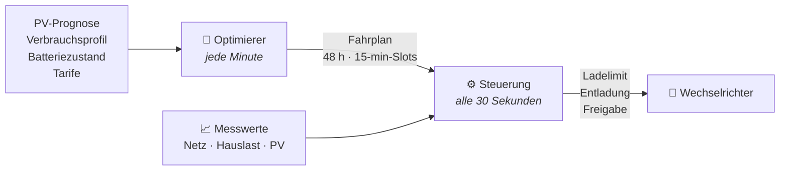
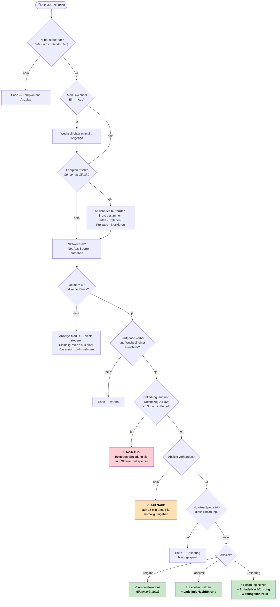

# Die Steuerung — vom Fahrplan zum Wechselrichter

Der EEG Energy Optimizer trennt **Rechnen** und **Steuern** strikt:

* Der **Optimierer** rechnet **jede Minute** den erlösbesten Lade- und
  Entladeplan über 48 Stunden — allein aus den Preisen je Viertelstunde, ohne
  Zeitfenster und ohne benannte Zustände. Er schreibt **nie** an den
  Wechselrichter. Gibt der Preisverlauf nichts her, plant er auch nichts.
* Die **Steuerung** läuft **alle 30 Sekunden**, hält den zuletzt gerechneten
  Fahrplan gegen die Messwerte und ist die **einzige** Stelle, die den
  Wechselrichter anfasst.


```mermaid
flowchart LR
    IN["PV-Prognose<br/>Verbrauchsprofil<br/>Batteriezustand<br/>Tarife"] --> OPT
    OPT["🧮 Optimierer<br/><i>jede Minute</i>"] -- "Fahrplan<br/>48 h · 15-min-Slots" --> EXE
    MESS["📈 Messwerte<br/>Netz · Hauslast · PV"] --> EXE
    EXE["⚙️ Steuerung<br/><i>alle 30 Sekunden</i>"] -- "Ladelimit<br/>Entladung<br/>Freigabe" --> WR["🔌 Wechselrichter"]
```

Warum zwei Takte? Der Plan ändert sich langsam (die Welt der Prognosen), die
Realität schnell (eine Wolke, ein Wasserkocher). Die Steuerung gleicht beides
aus: Sie setzt die **Absicht** des laufenden Slots um, korrigiert sie aber mit
den **gemessenen** Werten.

---

## Ein Steuerungslauf (alle 30 Sekunden)

Jeder Lauf ist eine Prüfkette, an deren Ende **eine Absicht** steht: Laden
begrenzen, Entladen oder Freigeben. Um sie umzusetzen, können mehrere
Schreibvorgänge nötig sein — etwa beim Wechsel von einer Entladung auf ein
Ladelimit erst das Stoppen der Entladung, dann das Limit. Die Absicht wird auch
im Modus **Aus** bestimmt (fürs Dashboard) — geschrieben wird nur im Modus
**Ein**.


```mermaid
flowchart TD
    START(["⏱️ Alle 30 Sekunden"]) --> SUP{"Treiber steuerbar?<br/><i>(alle sechs unterstützten)</i>"}
    SUP -- "nein" --> E1["Ende — Fahrplan nur Anzeige"]
    SUP -- "ja" --> WECHSEL{"Moduswechsel<br/>Ein → Aus?"}
    WECHSEL -- "ja" --> REL["Wechselrichter einmalig freigeben"] --> FRISCH
    WECHSEL -- "nein" --> FRISCH{"Fahrplan frisch?<br/><i>(jünger als 15 min)</i>"}
    FRISCH -- "ja" --> ABSICHT["Absicht des <b>laufenden Slots</b> bestimmen:<br/>Laden · Entladen · Freigabe · Blockieren"]
    FRISCH -- "nein" --> SLOT
    ABSICHT --> SLOT["Slotwechsel?<br/>→ Not-Aus-Sperre aufheben"]
    SLOT --> MODUS{"Modus = Ein<br/>und keine Pause?"}
    MODUS -- "nein" --> E2["Anzeige-Modus — nichts steuern.<br/>Einmalig: Werte aus einer<br/>Vorsession zurücknehmen"]
    MODUS -- "ja" --> BEREIT{"Startphase vorbei<br/>und Wechselrichter<br/>erreichbar?"}
    BEREIT -- "nein" --> E3["Ende — warten"]
    BEREIT -- "ja" --> NOTAUS{"Entladung läuft und<br/>Netzbezug &gt; 1 kW<br/>im 3. Lauf in Folge?"}
    NOTAUS -- "ja" --> NA["🛑 <b>NOT-AUS</b><br/>freigeben, Entladung bis<br/>zum Slotwechsel sperren"]
    NOTAUS -- "nein" --> PLAN{"Absicht vorhanden?"}
    PLAN -- "nein" --> FS["⚠️ <b>FAILSAFE</b><br/>nach 15 min ohne Plan<br/>einmalig freigeben"]
    PLAN -- "ja" --> SPERRE{"Not-Aus-Sperre trifft<br/>diese Entladung?"}
    SPERRE -- "ja" --> E4["Ende — Entladung<br/>bleibt gesperrt"]
    SPERRE -- "nein" --> AKTION{"Absicht?"}
    AKTION -- "Freigabe" --> AF["✅ Automatikmodus<br/><i>(Eigenverbrauch)</i>"]
    AKTION -- "Ladelimit" --> AL["🔋 Ladelimit setzen<br/>+ <b>Ladelimit-Nachführung</b>"]
    AKTION -- "Entladung" --> AE["⚡ Entladung setzen<br/>+ <b>Entlade-Nachführung</b><br/>+ <b>Wirkungskontrolle</b>"]

    style NA fill:#ffcdd2,color:#000
    style FS fill:#ffe0b2,color:#000
    style AF fill:#c8e6c9,color:#000
    style AL fill:#c8e6c9,color:#000
    style AE fill:#c8e6c9,color:#000
```

### Vom Slot zur Absicht

Der laufende Fahrplan-Slot wird treiberneutral in genau eine Absicht übersetzt:

| Slot plant … | Absicht | Warum |
|---|---|---|
| **Laden** | Ladelimit = Planleistung | Die Batterie darf höchstens so schnell laden, wie der Plan vorsieht — der Rest der PV geht ins Netz. |
| **Einspeisen aus der Batterie** | Erzwungene Entladung | Energie soll aktiv in die Energiegemeinschaft. |
| **Entladen nur für den Hausverbrauch** | Freigabe | Das erledigt der Wechselrichter im Automatikmodus selbst — kein Eingriff nötig. |
| **Nichts**, Batterie hat Platz | Ladelimit = 0 | Freigeben wäre falsch: Der Automatikmodus würde PV-Überschuss in die Batterie laden, den der Plan einspeisen will. An einem Sonnenmorgen sieht das dann von außen wie eine „Morgen-Einspeisung" aus — es ist aber keine Regel, sondern nur das Ergebnis der Preise dieses Tages. |
| **Nichts**, Batterie voll (im letzten Prozent vor dem Maximum-Ladestand) | Freigabe | „Nicht laden" ist hier keine Absicht, sondern Platzmangel. Ein Ladelimit 0 bewirkt nichts und stünde nur im Weg, sobald wieder Platz entsteht. Kein Eingriff, der Standardwert bleibt. |

---

## Die zwei Nachführungen

Prognosen sind nie exakt. Zwei Korrekturen halten den Plan gegen die Realität —
beide arbeiten mit **Messwerten**, nicht mit Prognosen.

### Ladelimit-Nachführung

Das Ladelimit wird **immer** geschrieben, sobald der Slot Laden (oder
Blockieren) plant — mit oder ohne Einspeisegrenze. Die Nachführung ist die
**Korrektur obendrauf** und läuft nur, wenn eine Einspeisegrenze konfiguriert
ist: Klebt die gemessene Einspeisung an der Grenze, regelt der Wechselrichter
gerade still ab — dann darf die Batterie mehr aufnehmen als geplant, damit
nichts verloren geht.

```
Gemessene Einspeisung                        Reaktion pro Lauf (30 s)
─────────────────────────────────────────────────────────────────────
━━━ Grenze ━━━━━━━━━━━━━━━━━━━━━━━━━┓
                                    ┣━ „klebt" (± 0,1 kW):
   Grenze − 0,1 kW ─────────────────┛      Ladelimit + 0,5 kW  ▲
                                    ┓
                                    ┣━ totes Band: nichts tun  ▬
   Grenze − 0,3 kW ─────────────────┛
                                    ┓
                                    ┣━ deutlich darunter:
   darunter                         ┛      halber Abstand zum Fahrplan-
                                           wert zurück (mind. 0,5 kW),
                                           nie darunter  ▼
```

Das **asymmetrische tote Band** verhindert Pendeln zwischen Anheben und
Rücknahme. Nach jedem Anheben wartet die Nachführung einen Lauf ab, solange
noch eingespeist wird: Der Wechselrichter braucht einen Moment, bis er die PV
nachgeführt hat, und ohne diese Pause verschwände — zusammen mit einem
zurückregelnden Heizstab — mehr Last, als tatsächlich fehlt. Die Rücknahme halbiert den Abstand je Lauf, weil ihr Ziel bekannt
ist — mit festen Schritten wäre der Slot oft vorbei, bevor sein Planwert
wirkt. Ohne Einspeisegrenze (oder wenn der Netz-Messwert fehlt) wird
schlicht der Fahrplanwert geschrieben — fail-open.

### Entlade-Nachführung

Der Wechselrichter deckt bei einer erzwungenen Entladung **zuerst den
Hausverbrauch**, nur der Rest wird eingespeist. Damit die *geplante*
Einspeisung tatsächlich am Netzanschluss ankommt, wird die gemessene Hauslast
aufgeschlagen:

```
Entladeleistung = Plan-Einspeisung + gemessene Hauslast − aktuelle PV
                  (gedeckelt auf die maximale Entladeleistung der Batterie)

Ziel-SOC        = geplanter Ladestand am ENDE des laufenden Slots
```

Liefert die PV gerade genug, um den Plan zu decken (Rest < 0,05 kW), wird gar
nicht erzwungen entladen — Freigabe. Ist die Hauslast nicht messbar, greift die
Prognose des Slots (fail-open, geloggt).

**Ausnahme SMA:** Dort ist die Entladung ein Sollwert am *Netzanschluss* — der
Wechselrichter legt die Hauslast selbst obendrauf. Die Steuerung gibt deshalb
direkt die geplante Einspeisung vor, ohne Hauslast und PV aufzurechnen.

### Wirkungskontrolle

Dass der Wechselrichter einen Befehl bestätigt, heißt noch nicht, dass er ihn
auch ausführt. Deshalb prüft die Steuerung während jeder Entladung, ob die
Batterie tatsächlich liefert — bei SMA, dessen Vorgabe ein Netz-Sollwert ist,
am Netzzähler statt an der Batterie: Bleibt die gemessene Leistung **sechs Läufe lang
(3 Minuten) unter der Hälfte der Vorgabe und mehr als 0,3 kW darunter**, wird
die Entladung gestoppt und im nächsten Lauf neu gesetzt. Beide Bedingungen
müssen zusammen erfüllt sein — sonst löste bei kleinen Vorgaben schon das
Rauschen aus. Das geschieht höchstens zweimal je Slot; danach meldet die
Statuskarte das Problem, statt zwischen Stopp und Befehl hin und her zu
springen. Ist der Ziel-Ladestand erreicht, gilt die Entladung als erfüllt und
wird nicht geprüft.

---

## Sicherheitsnetze

| Netz | Auslöser | Wirkung |
|---|---|---|
| 🛑 **Not-Aus** | Netzbezug > 1 kW in 3 aufeinanderfolgenden Läufen (= 90 s) während einer Entladung | Entladung stoppen, bis zum nächsten Slotwechsel sperren. Verhindert, dass Strom teuer gekauft und billig verkauft wird. |
| ⚠️ **Failsafe** | Kein brauchbarer Fahrplan seit 15 Minuten (Optimierer eingefroren, Daten fehlen) | Wechselrichter einmalig in den Automatikmodus freigeben — kein Limit bleibt stehen. |
| 🔄 **Freigabe bei Ein → Aus** | Moduswechsel | Sofortige Freigabe, sonst bliebe das letzte Ladelimit im Gerät stehen. Gleiches beim Entladen der Integration (Neustart, Konfig-Änderung). |
| ⏳ **Startphase** | Erste 90 Sekunden nach dem Start | Noch keine Steuerbefehle — erst Messwerte sammeln. Danach im Modus **Ein** zuerst eine Freigabe, die Steuerwerte aus der Zeit vor dem Neustart zurücknimmt, erst dann der Plan; scheitert die Freigabe, gibt es bis zu drei Versuche („Startphase: Freigabe fehlgeschlagen — wird wiederholt“). |
| ♻️ **Nachgeholte Freigabe** | Erster Lauf nach einem Neustart, während wir *nicht* steuern | Ein Limit aus der Vorsession käme im Anzeige-Modus sonst nie zurück — es würde dort nie geschrieben. Wird bis zum Erfolg wiederholt. |
| 📏 **Totbänder** | Änderung ≤ 0,2 kW (Ladelimit, Entladeleistung) bzw. < 1 %-Punkt (Ziel-SOC) | Nicht schreiben — der Wert im Gerät ist noch gut genug. Minimiert die Schreibzugriffe drastisch. |
| 🔁 **Wirkungskontrolle** | Batterie (bei SMA: Netzeinspeisung) liefert während einer Entladung 3 Minuten lang weniger als die Hälfte der Vorgabe | Entladung stoppen und neu setzen, höchstens zweimal je Slot (siehe oben). |
| 🐢 **Schreibbremse** | Der Wechselrichter lehnt einen Befehl ab | Nicht in jedem Lauf wiederholen, sondern mit doppeltem Abstand (1, 2, 4 … bis 10 Läufe = 5 Minuten). Der Grund steht im Aktivitätsprotokoll. |
| ⏸️ **Pause** | Im Dashboard gestartet, oder Dienst `eeg_energy_optimizer.pause` | Verhält sich wie Modus **Aus** und endet von selbst — nach der gewählten Dauer (¼ bis 48 h) oder sobald der gewählte Ladestand erreicht ist. Übersteht einen Neustart. |

---

## Freigabe heißt: Standardwert

„Freigabe" ist kein eigener Zustand im Wechselrichter, sondern die Rückkehr zu
seinen Standardwerten: Ein gesetztes Ladelimit wird aufgehoben und eine
laufende Zwangsentladung gestoppt. Wie das am Gerät aussieht, hängt vom Treiber
ab — bei Huawei wird das Ladelimit auf das Maximum der Number-Entität gesetzt
(bei einer 5-kW-Batterie also 5 kW), bei den Modbus-Treibern (Fronius, Kostal,
SMA) geht die Batteriesteuerung zurück an die interne Automatik des
Wechselrichters.

Deshalb gilt: **Wir greifen nur ein, wenn der Fahrplan einen konkreten Wert
vorgibt.** Sonst stehen die Werte des Geräts.

Schlägt eine Freigabe fehl, merkt die Steuerung sich das *nicht* als erledigt —
sonst bliebe ein Limit für immer stehen. Der nächste Lauf versucht es erneut.

## Modus: Wer entscheidet, ob geschrieben wird?

Der Schalter oben im Dashboard (`select.eeg_energy_optimizer_optimizer`):

| Modus | Rechnen | Schreiben |
|---|---|---|
| **Ein** | jede Minute | Ladelimit und Entladung werden gesetzt |
| **Aus** | jede Minute | nichts — der Fahrplan wird nur angezeigt |

**Aus** nimmt gesetzte Steuerwerte zurück: Der Wechselrichter wird freigegeben
und läuft danach in seinem Automatikmodus (Eigenverbrauch).

Die **Pause** wirkt wie **Aus** auf Zeit: Sie gibt frei und endet von selbst.

Geschrieben wird nur, wenn sich die Absicht ändert oder ein Wert das Totband
verlässt; wie das am jeweiligen Gerät aussieht, übernimmt der Treiber des
Wechselrichters — die Steuerung selbst kennt keine Modbus-Register und keine
Entitäten.

## Heizstab

Ist ein Heizstab (Fronius Ohmpilot) eingerichtet, führt die Steuerung ihn nach
jedem Lauf nach: Plant der laufende Slot Wärme, regelt sie auf „Einspeisung
≈ 0“, gedeckelt auf die geplante Leistung. Plant er keine, nimmt der Heizstab
nur den Überschuss, der an der Einspeisegrenze sonst abgeregelt würde — ohne
eingestellte Einspeisegrenze an der AC-Grenzleistung minus 0,5 kW. Diesen
ungeplanten Überschuss teilt er sich mit der Batterie nach deren Ladestand:
unter 20 % bekommt die Batterie alles, ab 50 % die Hälfte. Während einer
Entladung und im Modus Aus bleibt er aus.

Unter der **Mindesttemperatur** hat der Heizstab Vorrang vor der Einspeisung:
Er nimmt allen PV-Überschuss, aber weder Netz- noch Batteriestrom. Nur wenn
„Unter der Mindesttemperatur auch aus dem Netz heizen“ eingeschaltet ist, heizt
er dann mit voller Leistung von überall, und die Steuerung gibt eine geplante
Entladung derweil frei, statt ins Netz zu entladen. Details in der Anleitung
[Heizstab](guides/heizstab.md).

---

*Technische Referenz: `custom_components/eeg_energy_optimizer/schedule_executor.py`
(Klasse `ScheduleExecutor`), Konstanten in `const.py`.*
